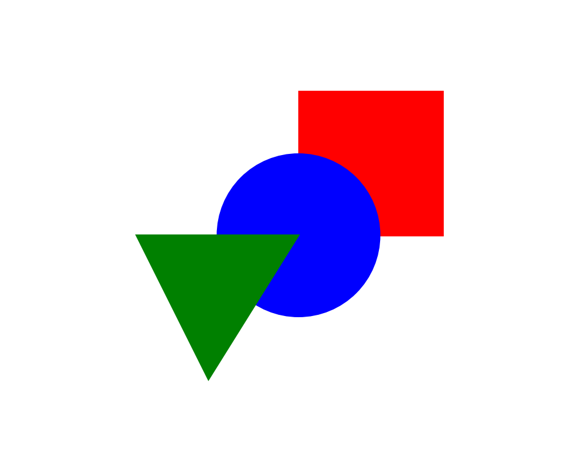
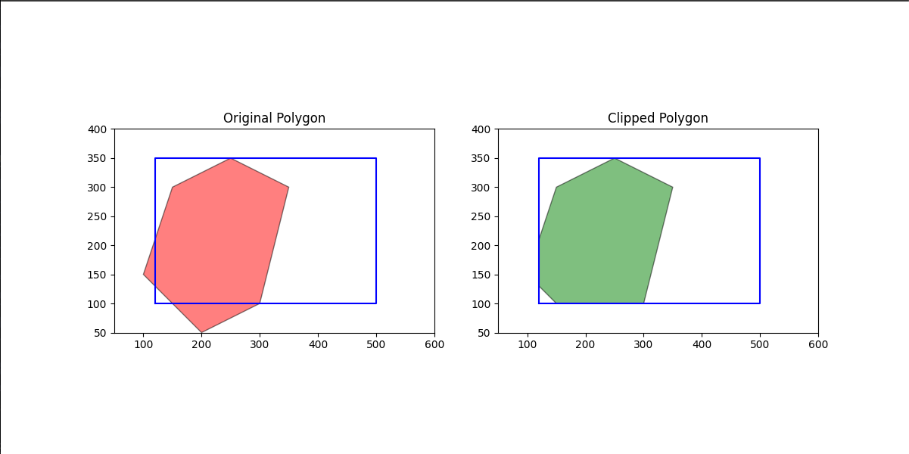
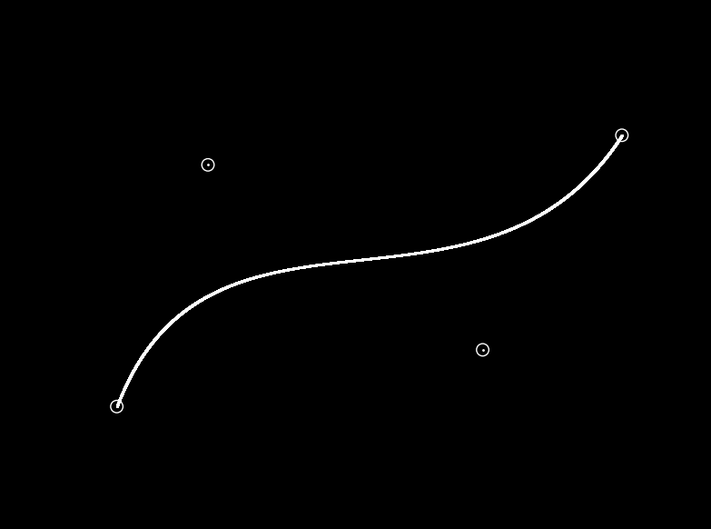
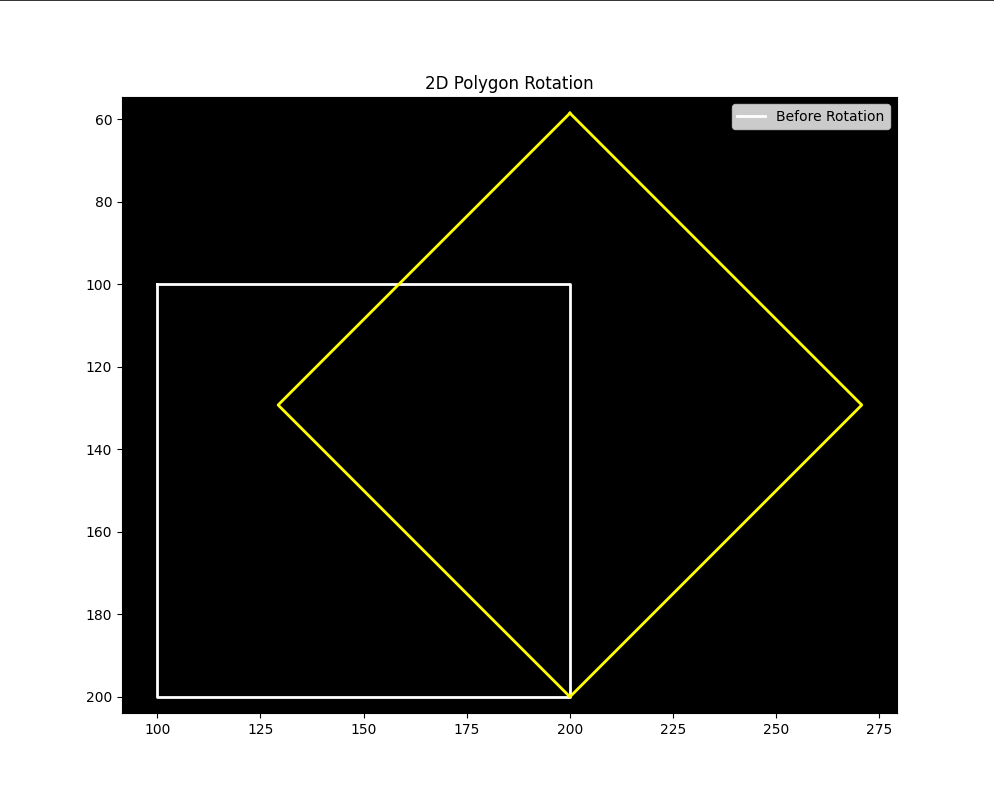
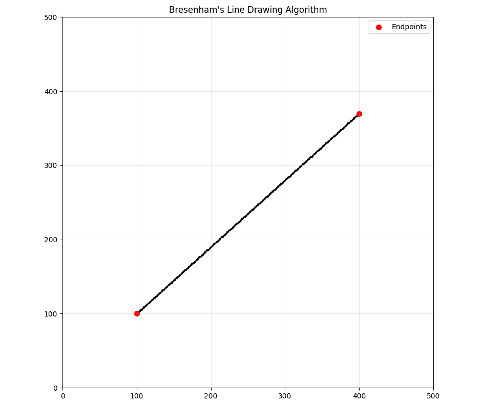
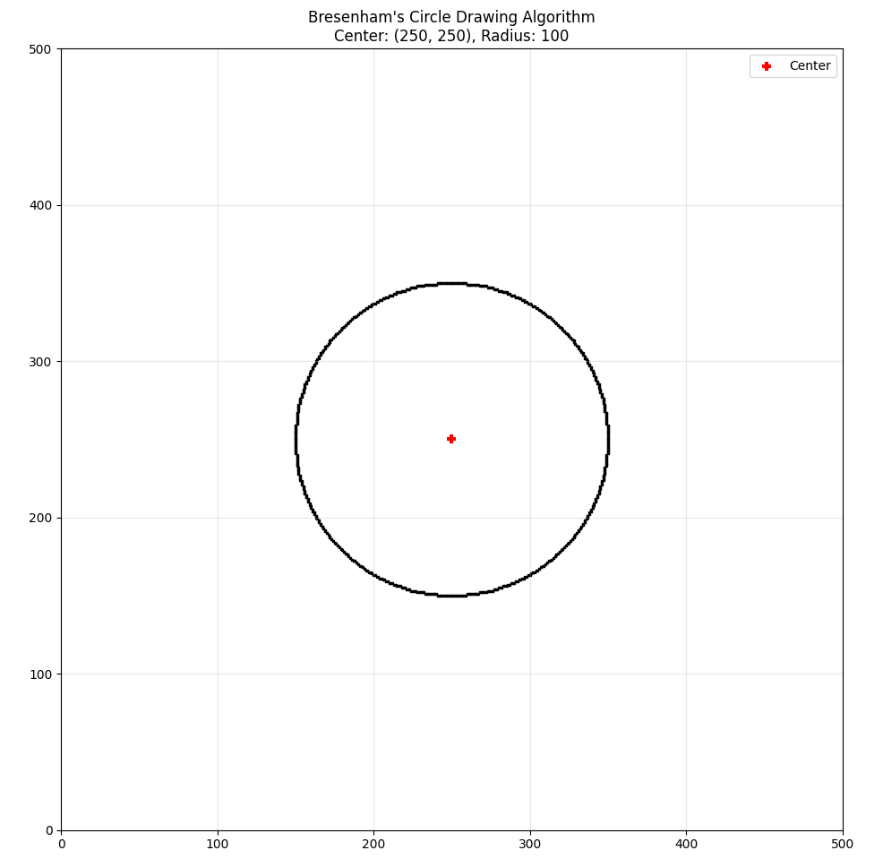
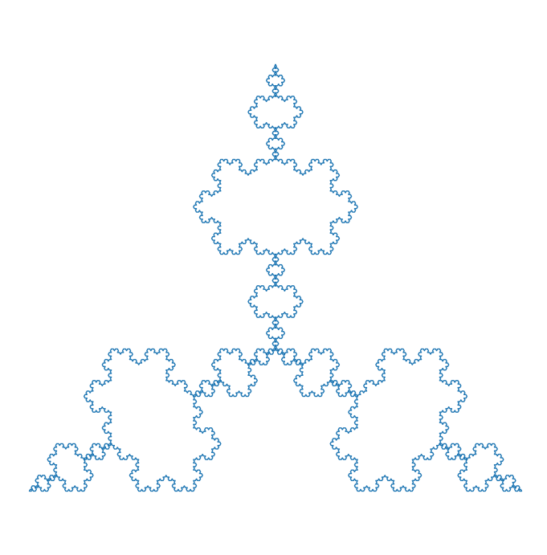

# CSE4221: Computer Graphics Lab 🎨

[](https://www.python.org/downloads/)
[](https://matplotlib.org/)
[](https://numpy.org/)

A comprehensive collection of computer graphics algorithms and simulations implemented in Python. This repository contains solutions to all 8 experiments from the CSE4221 Computer Graphics Lab Manual.

## 📋 Lab Manual Overview

### Warm Up Tasks ✨
- [x] Draw the National Flag of Bangladesh
- [x] Write your name with animation  
- [x] Simulate a scene of traveling through space

### Main Experiments 🧪

| # | Algorithm | File | Output Preview | Status |
|---|-----------|------|----------------|--------|
| 1 | Hidden Surface Elimination/Visual Surface Detection | [`1_Visual_surface_detection.py`](1_Visual_surface_detection.py) |  | ✅ Complete |
| 2 | Cohen-Sutherland Line Clipping | [`2_cohen_sutherland.py`](2_cohen_sutherland.py) |  | ✅ Complete |
| 3 | Sutherland-Hodgman Polygon Clipping | [`3_sutherland_hodgman_polygon.py`](3_sutherland_hodgman_polygon.py) |  | ✅ Complete |
| 4 | Bézier Curve Generation | [`4_bezier_curve.py`](4_bezier_curve.py) |  | ✅ Complete |
| 5 | 2D Geometric Transformations | Multiple files |  | ✅ Complete |
| 6 | Bresenham Line Drawing Algorithm | [`6_bresenham_line_drawing.py`](6_bresenham_line_drawing.py) |  | ✅ Complete |
| 7 | Bresenham Circle Drawing Algorithm | [`7_bresenham_circle_drawing.py`](7_bresenham_circle_drawing.py) |  | ✅ Complete |
| 8 | Koch Snowflake Fractal Geometry | [`8_koch_snowflake.py`](8_koch_snowflake.py) |  | ✅ Complete |

## 🚀 Features

### 🎯 Core Implementations
- **Hidden Surface Elimination**: Interactive 3D simulation with back-face culling and z-buffer algorithm
- **Line Clipping**: Cohen-Sutherland algorithm with visual feedback
- **Polygon Clipping**: Sutherland-Hodgman algorithm for complex polygons
- **Curve Generation**: Parametric Bézier curves with control points
- **2D Transformations**: Translation, rotation, and scaling with before/after visualization
- **Line Drawing**: Bresenham's efficient pixel-perfect line algorithm
- **Circle Drawing**: Bresenham's circle algorithm using 8-way symmetry
- **Fractal Geometry**: Recursive Koch snowflake with mathematical precision

### 🎨 Visual Features
- **Interactive Simulations**: Real-time animations and user input
- **Educational Visualizations**: Step-by-step algorithm demonstrations
- **Professional Graphics**: Matplotlib-based rendering with custom styling
- **Color-coded Output**: Different colors for before/after states
- **Mathematical Accuracy**: Precise implementations matching theoretical algorithms

## 📁 File Structure

```
Computer_Graphics_Lab/
├── 1_Visual_surface_detection.py      # Hidden surface elimination simulation
├── 1_hidden_surface_simulation.py     # Advanced 3D surface simulation
├── 2_cohen_sutherland.py              # Line clipping algorithm
├── 3_sutherland_hodgman_polygon.py    # Polygon clipping algorithm
├── 4_bezier_curve.py                  # Bézier curve generation
├── 5_two_dimentional_rotaion.py       # 2D rotation transformation
├── 5_two_dimentional_scaling.py       # 2D scaling transformation
├── 5_two_dimentional_translation.py   # 2D translation transformation
├── 6_bresenham_line_drawing.py        # Bresenham line algorithm
├── 7_bresenham_circle_drawing.py      # Bresenham circle algorithm
├── 8_koch_snowflake.py                # Koch snowflake fractal
├── img/                               # Output images directory
├── env/                               # Python virtual environment
└── README.md                          # This file
```

## 🛠️ Setup & Installation

### Prerequisites
- Python 3.8 or higher
- pip package manager

### Installation Steps

1. **Clone the repository**
   ```bash
   git clone https://github.com/mdsajjadhossain25/Computer_Graphics_Lab.git
   cd Computer_Graphics_Lab
   ```

2. **Activate virtual environment**
   ```bash
   source env/bin/activate  # On Linux/Mac
   # or
   env\Scripts\activate     # On Windows
   ```

3. **Install dependencies** (if needed)
   ```bash
   pip install matplotlib numpy
   ```

## 🎮 Usage Examples

### Running Individual Programs

```bash
# Hidden Surface Elimination
python3 1_Visual_surface_detection.py

# Line Clipping
python3 2_cohen_sutherland.py

# 2D Transformations
python3 5_two_dimentional_rotaion.py

# Fractal Generation
python3 8_koch_snowflake.py
```

### Interactive Features

Most programs support interactive input:

```bash
# Example: 2D Rotation
python3 5_two_dimentional_rotaion.py
# Input: number of vertices, coordinates, angle, pivot point

# Example: Bézier Curve
python3 4_bezier_curve.py  
# Input: control points, curve resolution
```

## 📊 Algorithm Details

### 1. Hidden Surface Elimination
- **Back-face Culling**: Removes surfaces facing away from viewer
- **Z-buffer Algorithm**: Sorts surfaces by depth
- **3D Visualization**: Interactive camera positioning

### 2. Cohen-Sutherland Line Clipping
- **Region Codes**: 9-region subdivision of 2D plane
- **Efficient Clipping**: Eliminates unnecessary line segments
- **Visual Feedback**: Shows clipped vs unclipped lines

### 3. Sutherland-Hodgman Polygon Clipping
- **Edge-by-edge Clipping**: Clips polygon against each window edge
- **Intersection Calculation**: Precise mathematical intersections
- **Complex Polygon Support**: Handles concave and convex polygons

### 4. Bézier Curves
- **Parametric Representation**: P(t) = Σ B(i,n) * P(i) * t^i * (1-t)^(n-i)
- **Control Point System**: Interactive curve shaping
- **Smooth Interpolation**: Continuous curve generation

### 5. 2D Geometric Transformations
- **Translation**: P' = P + T
- **Rotation**: P' = R(θ) * P (around pivot point)
- **Scaling**: P' = S * P (with scaling factors)

### 6. Bresenham Line Algorithm
- **Integer Arithmetic**: No floating-point calculations
- **Decision Parameter**: Efficient pixel selection
- **Optimal Performance**: Minimal computational overhead

### 7. Bresenham Circle Algorithm
- **8-way Symmetry**: Calculates 1/8 of circle, mirrors to all octants
- **Midpoint Criterion**: Determines next pixel position
- **Integer Operations**: Fast circle rendering

### 8. Koch Snowflake Fractal
- **Recursive Generation**: Self-similar pattern at all scales
- **Fractal Dimension**: log(4)/log(3) ≈ 1.26
- **Mathematical Beauty**: Infinite perimeter, finite area

## 🎯 Key Learning Outcomes

- ✅ Understanding of fundamental computer graphics algorithms
- ✅ Implementation of efficient geometric computations
- ✅ 2D and 3D coordinate system transformations
- ✅ Real-time graphics rendering techniques
- ✅ Mathematical foundations of computer graphics
- ✅ Optimization strategies for graphics algorithms

## 🔧 Technical Specifications

- **Language**: Python 3.8+
- **Graphics Library**: Matplotlib
- **Mathematics**: NumPy
- **Rendering**: 2D and 3D visualization
- **Animation**: Real-time updates and simulations
- **Input**: Interactive parameter specification

## 📈 Performance Features

- **Optimized Algorithms**: Integer arithmetic where possible
- **Memory Efficient**: Minimal storage requirements
- **Real-time Rendering**: Smooth animations and interactions
- **Scalable**: Works with various input sizes

## 🤝 Contributing

Feel free to contribute to this repository by:
1. Adding new graphics algorithms
2. Improving existing implementations
3. Adding more interactive features
4. Enhancing documentation

## 📝 License

This project is created for educational purposes as part of the CSE4221 Computer Graphics course.

## 📧 Contact

**Md Sajjad Hossain**
- GitHub: [@mdsajjadhossain25](https://github.com/mdsajjadhossain25)

---

<div align="center">

### 🌟 Highlights

> "Computer Graphics is the art of turning mathematics into visual magic!" 

This repository demonstrates the beautiful intersection of mathematics, algorithms, and visual art through practical implementations of fundamental computer graphics techniques.

**🎨 All 8 lab experiments successfully implemented with interactive visualizations and educational features!**

</div>
